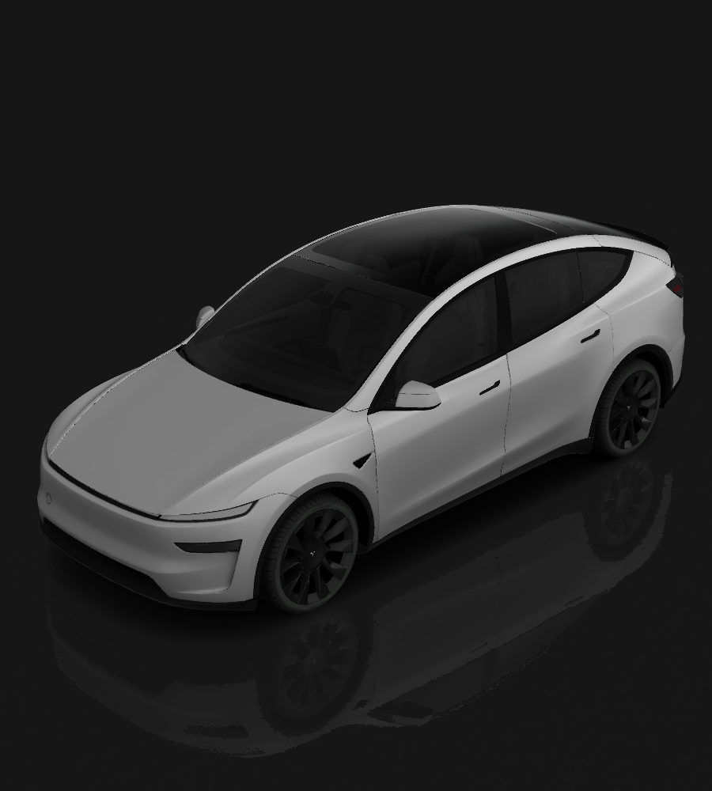
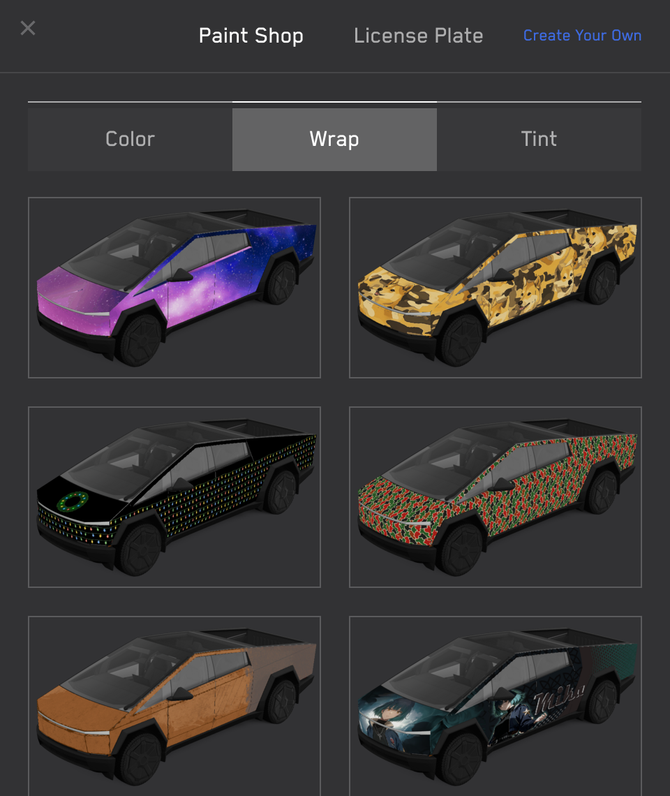
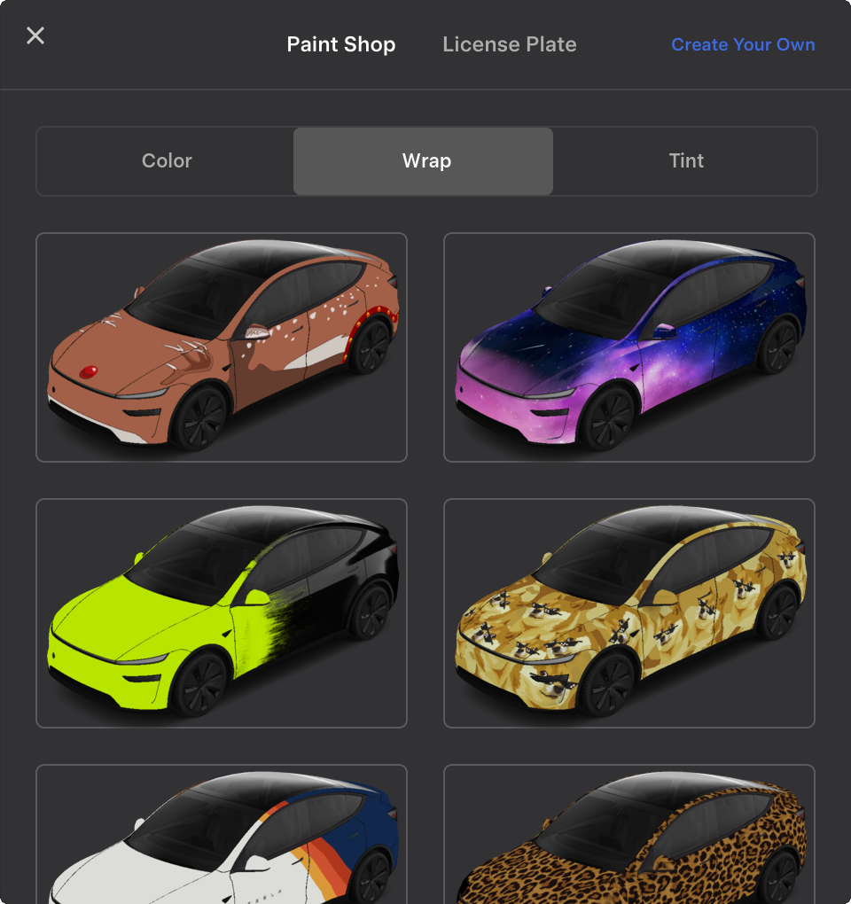

# Custom Wrap Images for Tesla Vehicles

This repository provides templates and examples for creating custom wrap designs for your Tesla's 3D vehicle visualization. Personalize your car's appearance in the Paint Shop with your own unique designs.

## How to Use Custom Wraps

1. **Download** the template for your specific vehicle model (see links below)
2. **Edit** the template with your custom design (fill in the white areas)
3. **Save** your design as a PNG file (512x512 to 1024x1024 pixels, max 1 MB)
4. **Load** your wraps onto a USB drive in a folder called `Wraps`
5. **Apply** in your Tesla: Toybox → Paint Shop → Wraps tab

## Select Your Vehicle

Choose your vehicle to download the template and view example wraps:

<table>
<tr>
<td align="center" valign="top">
 
<a href="cybertruck/"><b>Cybertruck</b> </a>
</td>
<td align="center" valign="top">
 
<a href="model3/"><b>Model 3</b> </a>
</td>
<td align="center" valign="top">
 
<a href="model3-2024-base/"><b>Model 3 (2024+)</b> Standard & Premium</a>
</td>
</tr>
<tr>
<td align="center" valign="top">
 
<a href="model3-2024-performance/"><b>Model 3 (2024+)</b> Performance</a>
</td>
<td align="center" valign="top">
 
<a href="modely/"><b>Model Y</b> </a>
</td>
<td align="center" valign="top">
 
<a href="modely-2025-base/"><b>Model Y (2025+)</b> Standard</a>
</td>
</tr>
<tr>
<td align="center" valign="top">
 
<a href="modely-2025-premium/"><b>Model Y (2025+)</b> Premium</a>
</td>
<td align="center" valign="top">
 
<a href="modely-2025-performance/"><b>Model Y (2025+)</b> Performance</a>
</td>
<td align="center" valign="top">
 
<a href="modely-l/"><b>Model Y L</b> </a>
</td>
</tr>
</table>

## Requirements & Setup

### Image Requirements

* **Resolution**: 512x512 to 1024x1024 pixels (use template size for best results)
* **File Size**: Images must be no larger than 1 MB.
* **File Name**: Use alphanumeric characters, underscores, dashes, and spaces only (max 30 characters).
* **File Format**: Images must be in PNG format.
* **File Count**: Up to 10 images can be used at a time.

### USB Drive Setup

1. Format the USB drive as one of the following:
    + exFAT
    + FAT 32 (for Windows)
    + MS-DOS FAT (for Mac)
    + ext3
    + ext4
    + Note: NTFS is not currently supported
2. Create a folder called `Wraps` at the root level of the drive
3. Place your PNG files inside the `Wraps` folder
4. Ensure the drive doesn't contain map or firmware updates

### Applying Wraps in Your Vehicle
Once loaded, wraps will appear in Toybox → Paint Shop → Wraps tab:

 
 

### Troubleshooting

If you encounter any issues with loading or applying wrap images, please check the following:

* Ensure that the USB drive is formatted correctly and does not contain any map update or firmware update files.
* Verify that the wrap images meet the requirements listed above.
